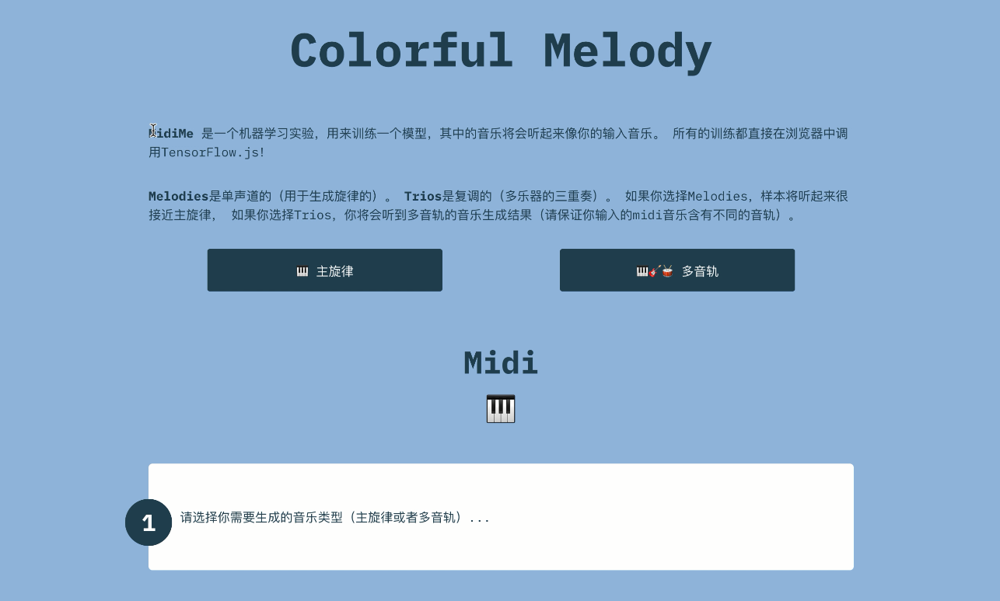

## 1、实验目的和背景

很久之前，莫扎特曾经创作过一首《骰子音乐》，通过丢骰子的方法自动选择小节组合，组合出来的完整音乐仍然悦耳，但是创作的过程带有一定的随机性。 1950年代计算机发明后，出现了第一批计算机音乐。最早的音乐构建了一个马尔科夫过程，使用随机模型进行生成，辅以rule-based的方法挑选符合要求的结果。

而现在随着机器学习的发展，算法能从原始的音乐数据中自动地学习出一些规律，从而生成符合人们听觉习惯和审美感受的音乐。 NVIDIA的AIVA模型、 Google Magenta的MusicVAE模型、 OpenAI的Jukebo模型都是AI作曲领域中的佼佼者。

在音乐制作这个实验中，小组希望可以通过使用深度学习某些技巧和框架，让更多的人即使不了解任何音乐理论，都能创作出属于自己的原创音乐 。用深度学习的方法降低音乐制作的门槛，并通过趣味性的可视化，让更多的人感受音乐的魅力。基于这个目标，项目需要完成以下要求：

* 用户只需要调整少量参数完成音乐制作
* 通过神经网络自动生成音乐，保证音乐的艺术性和独特性
* 设计音游，将生成的音乐进行必要的可视化，实现交互性和趣味性
* 基于Web端构建，跨平台支持

## 2、功能设计

### 2.1 总体功能设计

项目分为两个主要的模块，分别是**音乐生成**模块和**音乐游戏**模块。在音乐生成模块，用户可以调整参数，生成独一无二且符合人类听觉习惯的音乐。在音乐游戏模块，我们根据之前用户制作的音乐生成地图，用户可以通过上下左右键完成跑酷游戏，打造专属音游。


### 2.2 各模块界面

#### 2.2.1 欢迎界面



#### 2.2.2 音乐生成

  

#### 2.2.3 音游界面


## 3、项目原理

### 3.1 MIDI格式解析与原理

在音乐生成模块中，MusicVAE是基于MIDI格式对音乐进行训练、生成的，然后将生成MIDI格式导出为JSON格式交由音游模块生成相应的地图。

MIDI(Musical Instrument Digital Interface)是数字音乐国际的标准，定义了计算机音乐程序、合成器及其他电子设备交换信息和电子信号的方式，解决不同电子乐器之间不兼容的问题。MIDI文件中包含音符、定时和多达16个通道的演奏定义。文件包括每个通道的演奏音符信息：键通道号、音长、音量和力度等。 

MIDI文件是二进制文件，其内部主要记录了乐曲播放时，音序器应发送给音源的MIDI指令和每条指令发送的时间点。音序器读取这些时间信息和MIDI指令，通过在相应的时间发送相应的指令，以实现乐曲中音符的顺序播放和节拍信息。除了音序器需要发送的MIDI事件之外，MIDI文件内部也记录了一些辅助信息，如版权信息、音轨名、速度信息、拍号、调号等等，这些信息被称为Meta-event，只用于记录一些曲子的信息，通常并不发送给MIDI系统中的其他设备。

Midi是由一种名为“Chunk”的数据结构构成的，每个chunk由最初4字节的“Chunk类型”，紧接着4字节的“Chunk大小”（描述的是“Chunk 数据”的长度，而不是整个Chunk的长度。），和最后长度可变的“Chunk数据”构成。

构成MIDI文件的Chunk主要有两种类型：一种是Header Chunk（MThd），另一种是Track Chunk（MTrk）。

Header Chunk位于整个MIDI文件的起始处，是必须存在的，其起始标记就是ASCII码形式的“MThd”字符串。Track Chunk的起始标记，依然是ASCII码形式的“MTrk”字符串，并且Track Chunk整块分布于MIDI文件之中的任何位置，数量也不定，从1块到若干块皆可。实际上一个MIDI文件就是由一个Header Chunk和若干Track Chunk组成。读者若使用一个十六进制编辑软件（如UltraEdit）打开并查看一个MIDI文件时，便能找到这两部分。

#### 3.1.1 MThd

MThd也就是Header Chunk，它位于整个MIDI文件的起始处，在每个 Midi 文件的开头都有如下内容：
`4d54 6864 0000 0006 ffff nnnn dddd`
其中：

1. `4d54 6864`是ACSII表示的“MThd”字符串，表示构成MIDI文件的Chunk类型是文件头（Header Chunk）。
2. `0000 0006`是MThd中数据部分的长度，以目前标准均为6字节，也就是接下来的`ffff nnnn dddd`。
3. `ffff`制定Midi文件的格式，具体数据及对应含义如下图所示。
4. `nnnn`值表示文件中有多少个MTrk块。对于MIDI 0格式文件，`nnnn`值仅为0001，即只有一个Track Chunk；MIDI 1格式文件则可以有多个Track Chunk，而且Track Chunk数目为实际的音轨数目加一。
5. `dddd`值多采用TPQN时间度量法。TPQN是“Ticks Per Quarter-Note（每四分音符中所包含的Midi Tick数量）”的缩写，可以是十进制的60-480之间，**数值越大，MIDI系统的时间分辨率就越大，也就是说可以演奏时值越小的音符**。通常这个数都采用120、240、480，因为这些数都能被2、3、4甚至6、8整除，方便于八分音符、十六分音符、三连音甚至更短音符的演奏，换算成十六进制，就是0x78、0xF0、0x1E0。当然注意，这些十六进制数的最高位都是0。`dddd`值如果大于0x8000，则为SMPTE时间码度量法，这里不详细介绍了。


#### 3.1.2 MTrk

MTrk（也就是Track Chunk）内部则包含了实际的MIDI信息和一些辅助信息，如版权信息、音轨名、速度信息、拍号、调号等等。

我们以下面这个Midi文件的数据为例：

>4d54 6864 0000 0006 0000 0001 0064 4d54
>726b 0000 03a9 00c0 0000 903c 5a00 903f
>5a00 9043 5a00 9048 5a78 803f 0000 904b
>5a78 803c 0000 8043 0000 8048 0000 9037
>5a00 9046 5a78 8037 0000 8046 0000 9038
>5a00 9048 5a00 904d 5a78 8038 0000 8048
>0000 804b 0000 903a 5a00 9046 5a00 904a
>5a78 803a 0000 804a 0000 804d 0000 903f

1. 首先`4d54 6864 0000 0006 0000 0001 0064`是上文介绍过的MThd部分。
2. `4d54 726b` 是MTrk的开头，也就是“MTrk”的ASCII编码。
3. `0000 03a9` 是MTrk数据部分的大小，这里转化为十进制是937。接下来就是937字节的数据。
4. `xxyy xxyyyy ... ...` xx代表了Delta-time，yy代表了真正的MIDI事件。这些MIDI事件才是音序器在播放MIDI文件时需要实时处理和发送的数据。
5. `00ff 2f00` 是Meta-event事件，表示此Track结束。

其中：

**Delta-time：**

时间差，表征着当前事件距离上一个事件有多长时间，单位为tick。音序器通过对MIDI Tick进行计数，判断是否该处理下一个MIDI事件。Delta-time使用**可变长度的格式**，最短1个字节，最长4个字节（最长可以表示0x0fffffff）。

具体来说，一个字节有 8 bit，将其最高位bit作为标志位设为0，剩下7 bit就可以表示 0~127。如果Delta-time值超过127，就将标志位设置为1，并且下一个字节用来继续表示Delta-time。只要当前字节标志位为 0，则表示可以结束读取Delta-time。

**MIDI事件**

包括：

1. 实际需要发送的数据（音序器直接将数据发送出去）
2. meta-event事件（音序器修改自身的相关参数）

- 下表详细说明了不同的数据对应的不同Midi时间，其中x 表示音轨 ，取值为0~F，比如 90 表示按下第一轨的音符。参数表示在Midi事件后需要读取的参数有几个以及他们各自表示的含义，一般来说每个参数占一个字节。


- 下表为不同的参数值与不同音符的对应关系


比如，在上文的例子中，MTrk头部及长度数据之后的Midi信息编码为：
`---- ---- ---- 00c0 0000 903c 5a00 903f`
`5a00 9043 5a00 9048 5a78 803f 0000 904b
5a78 ---- ---- ---- ---- ---- ---- ----`

部分解析如下：
`00 c0 00` ：时间差00，改变第一轨乐器，乐器号码为00
`00 90 3c 5a` ：时间差00，按下第一轨音符，音符号码为3c（60，C4，中央C），力度为5a（90）
`00 90 3f 5a` ：时间差00，按下第一轨音符，音符号码为3f（63，#D4），力度为5a（90）

`78 80 3f 00`：时间差78（120tick），松开第一轨音符，音符号码为3f（63，#D4），力度为5a（90）

最终Midi事件中包含的信息可以等价为：


### 3.2 MusicVAE原理

本次音乐制作大作业中小组在音乐生成模块中使用了Google Magenta的MusicVAE模型。Magenta是由Google Brain发起的旨在利用机器学习进行艺术创作的一个项目，而MusicVAE是Magenta的一个子项目，是一种用于学习乐谱隐空间的分层递归变化自动编码器。 为了便于利用MusicVAE构建工具，小组使用了Google发布的相关js库，并阅读论文《A Hierarchical Latent Vector Model for Learning Long-Term Structure in Music》学习了原理。 

#### 3.2.1 隐空间模型（latent space models）

隐空间模型的技术目标是将高维数据通过低维编码呈现出来，使得人们对于数据的直觉特点能够被容易的探索和操控，而音乐序列本质上也是具有高维特性的。以钢琴为例，任意一时刻88个键都有可能处于按下或者释放的状态，或者演奏者在休息。那么一共就有九十种可能（88键，1释放，1休息），如果记录下两小节4/4拍的16分音符就会出现$90^{32}$中可能的序列，远远超出计算能力。 所以我们需要使用隐空间技术将音乐序列转化为低维编码。在这个过程中我们可以学习到训练序列中的基本特征并排除非常规的随机序列，同时还能在低维空间中表示真实数据的变化，这意味着模型可以以很高的精度重建真实样本。此外，当在压缩数据集空间时，隐空间模型将会趋向于利用基本特征来组织，将类似的样本聚合在一起并按照定义它们特征的方差来进行排列。 

**隐藏空间模型的特点可以总结为以下3点：**

- 压缩表达：任何真实的样本都可以被映射到隐含空间中，并从中重建；
- 真实性：隐含空间中的任何点都代表着真实空间中的数据，即使数据不在训练集中；
- 平滑性：在隐含空间中邻近的样本具有相似的特性。

目前有很多模型可以学习到隐藏空间的表示，自动编码器就是其中的一种。它可以学习将每一个输入样本压缩为一个数值矢量（ latent code ），随后又基于 latent code 重建出相同的样本。自编码器的关键在于生成出比数据维度更小的矢量来表述数据。同时在这个过程中，自编码器会提取数据集中的特性。 

  

#### 3.2.2 LSTM循环神经网络

长短期记忆（Long short-term memory, LSTM）是一种特殊的RNN，主要是为了解决长序列训练过程中的梯度消失和梯度爆炸问题。相比普通的RNN，LSTM通过门控状态来控制传输状态，记住需要长时间记忆的，忘记不重要的信息，因而能够在更长的序列中有更好的表现。

  

LSTM单元如上图所示， 与普通的RNN只传递状态$a^{\langle t \rangle}$相比，它跟踪与更新每个时间步上的记忆变量$c^{\langle t \rangle}$ 以及隐藏状态$a^{\langle t \rangle}$，来记住一些长序列中的结构信息。根据 LSTM的当前输入$x^{\langle t \rangle}$和上一个状态传递下来的$a^{\langle t-1 \rangle}$拼接训练得到三个状态 ：
$$
遗忘门：Γ_f^{\langle t \rangle} = σ(W_f[ a^{\langle t-1 \rangle}, x^{\langle t \rangle}]+b_f )\\
更新门：Γ_u^{\langle t \rangle} = σ(W_u[ a^{\langle t-1 \rangle}, x^{\langle t \rangle}]+b_u )\\
输出门：Γ_o^{\langle t \rangle} = σ(W_o[ a^{\langle t-1 \rangle}, x^{\langle t \rangle}]+b_o )\\
$$
 其中，$Γ_f^{\langle t \rangle}$、$Γ_u^{\langle t \rangle}$、$Γ_o^{\langle t \rangle}$是由拼接向量乘以权重矩阵之后，再通过一个$sigmoid$激活函数转换成0到1之间的数值，来作为一种门控状态。 

LSTM内部主要有三个阶段：

* 忘记阶段：对上一个节点传进来的输入进行选择性忘记。通过计算得到的$Γ_f^{\langle t \rangle}$来作为忘记门控，来控制上一个状态的 $c^{\langle t-1\rangle}$哪些需要留哪些需要忘。 因此将这个遗忘门向量$Γ_f^{\langle t \rangle}$将与前一个单元状态相乘， $c^{\langle t-1\rangle}$因此，如果的$Γ_f^{\langle t \rangle}$一个值是等于0（或者 $\approx 0$），则意味着LSTM应该删除对应的信息，如果其中有=1的值，那么LSTM将保留该信息。 

* 更新阶段： 一旦我们忘记了之前的信息，就需要找到一种方法来更新它。与遗忘门相似，$\Gamma_u^{\langle t \rangle}$向量的值是在0-1之间，为了计算$c^{\langle t \rangle}$，它会与$\tilde c^{\langle t \rangle}$相乘。 $\tilde c^{\langle t \rangle}$是我们新创建的向量 ，它的计算公式为：
  $$
  \tilde c^{\langle t \rangle}= tanh(W_C[ a^{\langle t-1 \rangle}, x^{\langle t \rangle}]+b_C )\\
  $$
  于是我们可以得到综合遗忘和更新得到的最后的更新公式：
  $$
  c^{\langle t \rangle} = \Gamma_f^{\langle t \rangle}\ast c^{\langle t - 1 \rangle} + \Gamma_u^{\langle t \rangle} \ast \tilde c^{\langle t \rangle}
  $$

* 输出阶段：这个阶段将决定哪些将会被当成当前状态的输出。主要是通过$Γ_o^{\langle t \rangle}$来进行控制的。并且还对上一阶段得到的$c^{\langle t \rangle}$进行了放缩（通过一个tanh激活函数进行变化）。  

将上述LSTM单元循环调用，就可以实现不断由当前状态预测下一状态的功能，从而生成有上下文以来的长序列，结构如下图所示。


#### 3.2.3 模型整体结构

VAE是一种被广泛使用的生成模型，对于音乐这种序列数据同样可以用VAE生成，最直接的做法就是使用RNN将音乐编码为latent code，再用RNN将latent code解码为音乐。但是这种朴素的RNN存在缺点，对于长序列的音乐生成往往到一定时间节点之后就会“遗忘”latent code，局限在生成的局部信息中，导致出现“posterior collapse”的情况，即生成的结果基本与latent code无关。所以MusicVAE采用层次化的设计就显得尤为巧妙了，给每一小节分配一个新的向量，防止latent code消失。

**网络结构：Bidirectional Encoder + conductor RNN + Hierarchical Decoder**


- Bidirectional Encoder：这里用了一个两层的B-LSTM来进行编码，latent code是用正序逆序两个方向的hidden state的连接结果计算的
-  conductor RNN：在网络中增加了conductor RNN（两层单向LSTM）来生成新的输出小节，代替了原来直接利用latent code 初始化音符RNN解码器。 
- Hierarchical Decoder：朴素的RNN decoder会出现posterior collapse的情况，因此为了保证解码过程中始终利用latent code的信息，对解码器进行了层次化的设计。

层次的划分是基于音乐本身的结构特点：一首音乐包括$U$个小节，每个小节又包括$T$个节拍。基于这样的观察，latent code首先通过一个conductor RNN被映射为$U$个vector，这些vector就被用来初始化最终的Decoder RNN。在decode阶段，每$T$次RNN的隐藏状态就被初始化为下一个vector，对应了不同小节的音乐生成。在这样的设计之下，decoder RNN能通过这些vector来获取长程依赖，即一直都在利用latent code的信息。

### 4、实现

#### 4.1 项目整体实现

##### 运行流程

- 用户训练、配置生成满意的midi序列

- 将midi音乐序列保存为midi音乐文件
- 将midi文件发送到服务端
- 服务端将接收到的midi文件分别转换为json文件和mp3文件
- 将上诉文件保存到服务器本地供游戏地图生成和背景生成
- 进入游戏，加载地图和背景

##### 具体实现

- 将midi序列保存为音乐文件

```javascript
const midiSample = mm.sequenceProtoToMidi(currentSample);
const midiFile = new File(
    [midiSample],
    "midime_sample1.midi"
);
```

- 通过向服务端发出post请求，将midi文件发送到服务端,待服务端处理完成后，载入游戏

```javascript
axios({
    method:'post',
    url:Url,
    data:midiFile
})
.then((info)=>{
	console.log(info)；
    window.location.href = 'http://127.0.0.1:5500/game_make/web-mobile/index.html';
})
.catch((e) => console.log(e))
})
```

- 服务端监听post请求，将接收到midi文件保存到内存缓冲区

```javascript
app.on("request", (req, res) => {
  if (req.method == "POST") {
    var data = [];
    req.on("data", (chunk) => {
      data.push(chunk);
    });
  }
}
```

- 将midi文件转换为json文件

```javascript
var buffer = Buffer.concat(data);
fs.writeFile("./static/music/sample.midi", buffer, (err) => {
    if (!err) {
        //midi to json
        const midiData = fs.readFileSync("./static/music/sample.midi");
        const midi = new Midi(midiData);
        fs.writeFileSync(
            "./static/midi-sample.json",
            Buffer(JSON.stringify(midi))
        );
    }
}
```

得到的json文件:


- 将midi文件转换为mp3文件，并返回给客户端处理结果

```javascript
//midi to mp3
exec(
    "timidity sample.midi -Ow -o my_music.mp3",
    {
        cwd: path.join(process.cwd(), "static/music"),
    },
    (err, stdout, stderr) => {
        if (err) {
            console.log(err);
        }
        console.log(`stdout:${stdout}`);
    }
);
res.end("success");
```

- 客户端接收到处理返回结果，进入游戏

### 4.3 地图生成

#### 4.3.1 动态读取json文件

通过`assetManager`实现跨域读取文件。根据`json`文件中数组数据，将需要的数据压入数组。

```javascript
//获取json 将音符和长度存入数组
        var url='../../static/midi-sample.json';
        cc.assetManager.loadRemote(url,function(err,res){
            let notes=res.json.tracks[0].notes;
            for(let i=0;i<notes.length;i++){
                G.pos.push(notes[i].midi);
                G.len.push(notes[i].duration);
            }
        })
```

由于地图只选取主旋律部分，根据midi文件中`json`格式特性，仅获取第一个track的信息。根据每个音节的音符与长度构建每个地图块的位置和长度，因此只将`midi`和`duration`数据压入数组。

`json`中部分内容如下：

```json
 "notes":[
            {
                "duration":0.5,
                "durationTicks":220,
                "midi":61,
                "name":"C#4",
                "ticks":0,
                "time":0,
                "velocity":0.7086614173228346
            },
            {
            	"duration":0.5,
            	"durationTicks":220,
            	"midi":59,
            	"name":"B3",
            	"ticks":220,
            	"time":0.5,
            	"velocity":0.7086614173228346
        	}
          ]
```

#### 4.4.2 构建地图块组成地图

首先需要将记录`json`信息的数据设置成全局变量，方便其他脚本对它进行访问。

```javascript
window.G={
    pos:[cc.Integer],
    len:[cc.Float]
};//全局变量
```

在`Ground`脚本中添加`create`函数，根据`G`数组实例化预制体，并设置位置。

```javascript
create:function(){
        let length=100;
        for(let x=2;x<G.pos.length;x++){
            let prefab=cc.instantiate(this.prefab);
            this.node.addChild(prefab);
            prefab.x=length+G.len[x]*100;
            prefab.y=25*(G.pos[x]-G.pos[1]);
            length+=G.len[x]*200;
            prefab.getComponent('ground_control').parent=this.node;
        }
    }
```

按照音符位置依次设置地图块。由于游戏中预先放置了一个地图块作为依照点，实例化时从数组第三个元素开始访问（第一个元素是`json`文件基本信息）。实例化完成后需要为这些预制体添加父节点，方便后续地图移动控制。

游戏开始界面，未构建地图。


点击`play`后构建地图。


###  4.4 背景生成

#### 4.4.1 制作音乐条 [Prefab](https://docs.cocos.com/creator/manual/zh/getting-started/quick-start.html#制作-prefab)

将需要重复生成的节点单个音乐条`item`保存成 Prefab（预制）资源，作为我们动态生成节点时使用的模板。

添加`mgr`组件，在脚本中向该组件中动态添加子组件`item`。

#### 4.4.2 添加游戏控制脚本 音频可视化

利用[Web Audio API](https://developer.mozilla.org/zh-CN/docs/Web/API/Web_Audio_API)使音频可视化。

一个简单而典型的web audio流程如下：


##### 4.4.2.1 创建AudioContext对象

`AudioContext`接口表示由链接在一起的音频模块构建的音频处理图，每个模块由一个`AudioNode`表示。音频上下文控制它包含的节点的创建和音频处理或解码的执行。

```javascript
let AudioContext = window.AudioContext;
// audioContext 只相当于一个容器。
let audioContext = new AudioContext();
```

##### 4.4.2.2 创建AudioBuffer对象

AudioBuffer接口表示存在内存里的一段短小的音频资源，利用`AudioContext.decodeAudioData()`方法从一个音频文件构建，或者利用 `AudioContext.createBuffer()`从原始数据构建。把音频放入AudioBuffer后，可以传入到一个 `AudioBufferSourceNode`进行播放。

```javascript
// 要让 audioContext 真正丰富起来需要将实际的音乐信息传递给它的，也就是将 AudioBuffer 数据传递进去。
// 以下就是创建音频资源节点管理者。
self.audioBufferSourceNode = audioContext.createBufferSource();
// 将 AudioBuffer 传递进去。
self.audioBufferSourceNode.buffer = audioClip._audio;
```

##### 4.4.2.3 数据分析和可视化

`AnalyserNode`表示一个可以提供实时频率分析与时域分析的切点，利用分析器从音频内提取数据，这些分析数据可以用做数据分析和可视化。

```javascript
// 创建分析器。
self.analyser = audioContext.createAnalyser();
// 精度设置
self.analyser.fftSize = 256;
// 在传到扬声器之前，连接到分析器。
self.audioBufferSourceNode.connect(self.analyser);
```

初始化item

```javascript
for (let i = 0; i < 40; i++) {
  let item = cc.instantiate(this.item);
  this.mgr.addChild(item);
  item.y = 0;
  item.x = -560 + i * 28 + 14;
}
```

利用分析器中获取到的音频数据对组件进行数据的修改以进行绘制

```javascript
 draw (dataArray) {
   for (let i = 0; i < 40; i++) {
     let h = dataArray[i * 3] * 1.2;
     if (h < 5) h = 5;
     // this.mgr.children[i].height = h;
     let node = this.mgr.children[i];
     // 插值，不那么生硬
     node.height = cc.misc.lerp(node.height, h, 0.4);
   }
 },
```


## 5、个人总结

